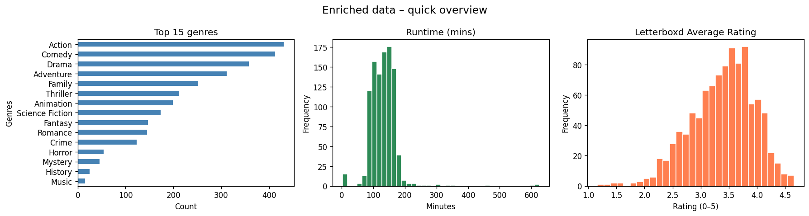

# Letterboxd Movie Ratings Analysis

A data science project exploring my personal movie watching history from [Letterboxd](https://letterboxd.com). This project covers everything from automated data scraping and cleaning to exploratory data analysis (EDA) and building a content-based recommendation system. The goal is to understand what drives my ratings and whether my taste can be modeled using machine learning.

---

## Overview

This project analyzes 1,005 movies I've watched and rated on Letterboxd. The original export only contains movie names, watch dates, and personal ratings — so the dataset was expanded by adding **genres**, **runtime**, and **average community ratings** using a custom scraping tool to "enrich" that data with community-driven metrics for each film to enable meaningful analysis.

The project is split into two main phases:
- **[Data Enrichment](notebook\letterboxd_enricher.ipynb)**: Automated scraping of Letterboxd HTML pages to build a comprehensive dataset.
- **[Analysis & Modeling](notebook\analysis.ipynb)**: Visualizing trends, comparing personal vs. community ratings, and building a K-Nearest Neighbors (KNN) recommender.

The **Analysis & Modeling** notebook covers:
- Exploratory data analysis and visualization
- Comparing personal ratings against community averages
- Attempting to predict my ratings using genre and runtime data
- Clustering movies based on taste patterns
- Building a simple content-based movie recommender

---

## Project Structure

```
letterboxd-analysis/
│
├── data/
│   ├── ratings.csv                # Raw export from Letterboxd
│   ├── ratings_enriched.csv       # Output generated by the enricher
│   └── enrichment_checkpoint.csv  # Auto-save file for the scraper
│
├── notebooks/
│   ├── letterboxd_enricher.ipynb  # Scraper: Adds Genres, Runtime, & Avg Rating
│   └── analysis.ipynb             # Main Analysis: EDA & Recommendation Engine
│
└── README.md
```

---

## Dataset

The dataset was originally exported ([ratings.csv](data\ratings.csv)) from Letterboxd and then expanded ([ratings_enriched.csv](data/ratings_enriched.csv)) using the enricher to include additional features:

| Column | Description |
|---|---|
| `Date` | Date I watched the movie |
| `Name` | Movie title |
| `Year` | Release year |
| `Letterboxd URI` | Letterboxd Page URL of the Movie |
| `Rating` | My personal rating (1.0 – 5.0) |
| `Genres` | Genre tags (multi-label) |
| `Runtime` | Movie duration in minutes |
| `Average Rating` | Community average rating on Letterboxd |

### Data Overview


---

## Key Findings

- **Genre and runtime alone cannot predict my ratings** — all regression models produced near-zero R² scores, suggesting personal taste is too nuanced for metadata to capture.
- **My ratings correlate weakly with the community average** (R² ≈ 0.39), but the relationship exists — I tend to rate movies I enjoy above the community consensus, and vice versa.
- **Genres I rate highest:** Documentary, Music, Mystery, Animation, and War films.
- **Genres I rate lowest:** TV Movies, Romance, and Action films.
- **KMeans clustering did not produce clean groupings**, likely due to the sparse, binary nature of one-hot encoded genre data.
- **The KNN recommender produced intuitive results** — similar movies were grouped correctly by genre and style.

---

## 📊 Visual Insights

### Personal vs. Community Ratings


This plot shows a moderate relationship between my ratings and the community average, indicating partial alignment but clear personal bias.

### Regression Fit


A simple linear model captures some correlation, but the variance suggests that personal taste is not fully explained by community trends.

### Feature Influence


Certain genres like Documentary and Music positively influence my ratings, while others like Romance and Action tend to score lower.

### Runtime vs Rating


Runtime has almost no predictive power, as ratings vary widely regardless of movie length.

### Clustering Results


K-Means clustering does not produce clear groupings, suggesting that my preferences are not easily separable into distinct categories.

---

## Tools & Libraries

* **Scraping:** `Requests`, `BeautifulSoup4`, `lxml`
* **Data Processing:** `Pandas`, `NumPy`
* **Visualization:** `Matplotlib`
* **Machine Learning:** `Scikit-learn` (KNN for recommendations)
* **UI/UX:** `tqdm` and `ipywidgets` for progress tracking

---

## Getting Started

1. **Installation**
   
   Clone the repository and install the required Python libraries:
   ```bash
   git clone https://github.com/your-username/letterboxd-analysis.git
   cd letterboxd-analysis
   pip install pandas numpy matplotlib scikit-learn requests beautifulsoup4 lxml tqdm
   ```

2. **Enrich Your Data**

    If you are using your own data, place your exported 'ratings.csv' into the 'data/' folder and run the enricher notebook:
    * Open notebooks/letterboxd_enricher.ipynb.
    * Run all cells to scrape the additional metadata.
    * **Note**: This notebook includes a checkpoint system, so you can safely stop and resume the process.

3. **Run the Analysis notebook**
   ```bash
   jupyter notebook notebooks/analysis.ipynb
   ```

> To use your own data, export your ratings from Letterboxd via **Profile → Export Your Data** and replace `data/ratings.csv`. 

---

## Limitations

- Scraping Speed: To respect Letterboxd's terms of service, the enricher includes a randomized delay between requests.
- Dataset Size: The recommendation model is currently optimized for personal libraries (~1,000+ entries).
- Accuracy: Genres and runtimes are parsed directly from HTML and may occasionally reflect specific edition metadata rather than the general theatrical release.
- With only ~1,000 entries, the dataset is relatively small for machine learning.
- Personal rating behavior (e.g. batch-watching a director's filmography) can skew year-based trends.

---

## Author

Made by **Siddharth Padakanti** — feel free to fork this and run it on your own Letterboxd data!